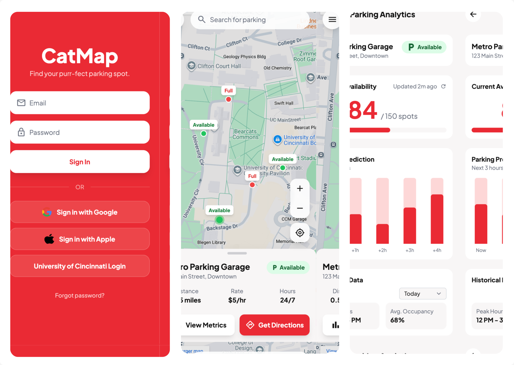

# CatMap v2

CatMap v2 is a campus parking navigation app currently being upgraded to provide **enhanced features** like **predictive parking availability** and **user login authentication**. The app helps users find the nearest parking lots, check real-time occupancy, and plan ahead with AI-driven predictions.

## 📸 Screenshots / UI Mockups

  

> Full UI mockup showing map interface, predictive information, and login panel.

## 🌟 Features

- **Real-time parking lot availability** with color-coded pins  
- **Predictive parking occupancy** to plan ahead  
- **User authentication & login system** for personalized experience  
- **OpenStreetMap powered map** for accurate location tracking  
- **Mobile and desktop friendly interface**  
- AI-powered insights for optimized parking recommendations  

## 🛠 Key Technologies

- **Backend:** Java, Spring Boot (with Thymeleaf for templating)  
- **Frontend:** JavaScript, Thymeleaf templates  
- **Mapping API:** OpenStreetMap  
- **AI / Prediction:**  
  - Weka or Deeplearning4j for Java-based predictive analytics  
  - Optional: TensorFlow Java API for advanced models  
- **Database:** MySQL / PostgreSQL (for parking history and user accounts)  


## 📈 How it Works

1. The **map interface** displays parking lots as pins.  
2. **Pin colors** indicate occupancy:
   - Green → Available  
   - Yellow → Filling Up  
   - Red → Full  
3. Click a pin to see detailed occupancy info.  
4. **Future Prediction:** AI models forecast parking availability for the next 30–60 minutes.  
5. **User Login:** Access personalized settings, saved preferences, and history.  

## 🔮 Future Plans

- Add **mobile push notifications** for parking alerts  
- Implement **route optimization** to available spots  
- Expand **AI prediction models** using historical campus traffic  
- Deploy **cloud-hosted backend** for scalability  

## 📌 Why CatMap v2 Matters

Finding a parking space on campus can be frustrating. CatMap v2 leverages AI, predictive analytics, and an intuitive map interface to:  

- Save time for students, staff, and visitors  
- Reduce traffic congestion in parking areas  
- Enable smarter, data-driven parking management  

## 📂 Project Structure
<pre>
CatMap-v2/
├─ src/main/java       # Java backend source code
├─ src/main/resources  # Thymeleaf templates & static assets
├─ src/main/webapp     # Web resources (JS/CSS)
├─ catmap.svg          # Full UI mockup
└─ README.md           # Project documentation
</pre>

## 🤝 Contribution

Contributions are welcome! Feel free to **fork**, submit **issues**, or create **pull requests**.  

## 🚀 Getting Started

```bash
# Clone Repository
git clone https://github.com/yourusername/catmap-v2.git
cd catmap-v2

# Build & Run Backend
./mvnw spring-boot:run

# Open Application
# Navigate to http://localhost:8080 in your browser
```
